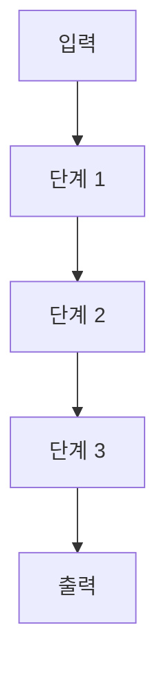

---
title:
first_author:
corresponding_author:
journal:
year:
doi:
date_created: <% tp.date.now("YYYY-MM-DD") %>
tags:
  - paper
status: analyzed
research_project:
---

## 한 줄 요약

## 방법론

### 핵심 로직
> 이 논문이 해결하려는 문제와 접근 방식의 핵심 아이디어를 서술.

- **문제 정의:**
- **핵심 아이디어:**
- **왜 이 접근이 유효한가 (근거/가정):**

### Flow Chart

### 방법론 흐름

| 단계 | 목적 | 핵심 방법 | 산출물 | 증거 (Figure/Page) |
|------|------|-----------|--------|---------------------|
| 1 | | | | |
| 2 | | | | |
| 3 | | | | |

### 방법 상세

#### 단계 1:
- **조건/파라미터:**
- **소프트웨어/장비:**
- **통계 처리:**
- **주의사항/한계:**

#### 단계 2:
- **조건/파라미터:**
- **소프트웨어/장비:**
- **통계 처리:**
- **주의사항/한계:**

## 결과 카드

---

### 결과 1:

**배경 & 질문**
-

**방법 요약**
-

**핵심 데이터 (사실)** — `Figure/Table/Page:`
-

**해석 (추론)** — `신뢰도: 높음/중간/낮음`
- 근거:
- 대안 가설:

**결론**
-

---

### 결과 2:

**배경 & 질문**
-

**방법 요약**
-

**핵심 데이터 (사실)** — `Figure/Table/Page:`
-

**해석 (추론)** — `신뢰도: 높음/중간/낮음`
- 근거:
- 대안 가설:

**결론**
-

---

## 한계점 & 미비 사항
-

## 내 연구와의 관련성
- 적용 가능한 점:
- 인용할 부분:

## 후속 행동
- [ ] 읽을 논문:
- [ ] 시도할 실험/분석:
- [ ] 배울 개념:

## Reference Trail

| 핵심 결과 | 본문 페이지 | Figure/Table/Supplement |
|-----------|-------------|--------------------------|
| | | |

## 내 생각 / 질문
-
